<p align="center">
  
</p>

<h1 align="center">🏠 SimpleSave</h1>
<p align="center"><b>Know your mortgage before you ever talk to a bank.</b></p>

SimpleSave is a React + Firebase re-platform of a real mortgage-advisory business: an anonymous "New Mortgage" journey that turns a long, confusing comparison process into a short questionnaire and an instant 5-way mix comparison — backed by the same calculation engine the advisory team already trusts, plus two AI agents that explain results and watch the market.

---

# 🚀 The Problem: "The Confusing Comparison"

Anyone shopping for a mortgage today runs into the same wall:

You contact a handful of banks, each quoting numbers in a different shape.

You try to compare them yourself — different rate types, indexation, repayment structures — with no common baseline.

To get any structured comparison at all, you fill out a long questionnaire... and if it drags on screen after screen, you abandon it halfway and never come back.

This results in:

- **Decision Paralysis** — no apples-to-apples way to compare mortgage mixes across banks
- **Questionnaire Fatigue** — every additional borrower or field balloons into more screens, so people drop off mid-flow
- **Wasted Advisory Capacity** — the advisory team already has a powerful, validated calculation engine (the original Hebrew simulator), but it's an isolated desktop tool: no customer accounts, no document flow, no way to actually serve online customers
- **No Transparency** — existing tools jump straight from a form to "the answer," with no visible reasoning in between

**There is currently no fast, trustworthy way to see where you stand on a mortgage before committing to a full advisory process.**

---

# ✨ The Solution: SimpleSave

SimpleSave delivers a real "New Mortgage" journey end-to-end: a short anonymous questionnaire whose progress is never lost, an instant 5-way mix comparison shown _before_ any signup wall, one clear registration moment that arrives only after the user already got value, and a personal area with progressive document collection — all running on the exact same calculation logic the advisory team relies on today, now hidden server-side for consumers and exposed instantly client-side for staff.

---

## 📋 Anonymous "New Mortgage" Questionnaire

- Loan type, property source, property value, equity, and 1–5 borrowers, all collected in a few combined screens — not one screen per borrower
- Auto-suggested monthly payment range derived from net income (existing loans/expenses deducted automatically)
- Step indicator so the user always knows how much is left
- Progress autosaved to the browser only — **zero Firebase writes happen before the user actually registers** (see [ADR-0001](docs/adr/0001-anonymous-progress-in-localstorage-only.md))
- Optional **chat-with-an-agent** mode as an alternative to the static form (same required fields, same output shape — see [ADR-0006](docs/adr/0006-agno-agents-for-intake-and-explanation.md))

---

## 🕐 5-Way Mix Comparison ("Clocks")

- Five mortgage-mix proposals (תמהילים), each showing first monthly payment, total payments, and total interest + indexation
- Visual risk indicator per proposal
- Drill-down view with monthly and cumulative principal/interest charts (Chart.js)
- Every number is computed **server-side** through a hidden Cloud Function — the underlying formulas never ship to the consumer's browser bundle

---

## 🔐 Registration & Personal Area

- Phone OTP or email/password via Firebase Authentication
- The anonymous draft transfers automatically into the user's account on signup — nothing is re-entered
- Three follow-up tracks after registration: buy-the-mix + paperwork, online guidance, or a personal advisor
- **Progressive lock** in the personal area: personal details → mortgage data → e-acknowledgment of disclosures (locked until prior step) → document upload (locked until signed) → in-principle approval (locked until documents are approved)
- Dynamic required-document checklist based on the user's actual situation (employee/self-employed, existing loans, rental income, etc.)
- Per-document status (pending review / approved / rejected with a reason) and an in-app messaging thread with the assigned advisor, live via Firestore `onSnapshot`

---

## 🧑‍💼 Advisor & Admin Screens

**Advisor**

- Sees only their own assigned clients (`assignedAdvisorUid`), never another advisor's
- Per-client checklist (personal details / mortgage data / documents / in-principle approval) to prioritize work
- Approves or rejects documents (rejection requires a reason)
- Edits a client's routes/mix with the same instant, no-server-roundtrip recalculation as the original simulator

**Admin**

- Dashboard of open requests by type
- Assigns/reassigns leads to advisors and inspects each advisor's caseload
- Edits market rate tables, the annual/monthly CPI index, risk rules, and fixed mix templates ("clocks") — all without touching code
- Full access to every client's request, independent of advisor assignment

---

## 🧮 Shared Calculation Engine

- Ported 1:1 from the original `סימולטור_משכנתא.html` simulator — `PMT`, `calcRoute`, `calcMix`, `mixRisk`, `riskRuleForRoute` — **no formula was changed**
- Every variant is covered: שפיצר vs. קרן שווה boards, balloon/grace structures, CPI/USD/EUR indexation, daily vs. monthly interest compounding, and split-purpose routes
- Golden-value tests extracted by running the _original_ functions in a real browser (Playwright), not hand-computed
- **One source of truth**: [`app/src/calc-engine`](app/src/calc-engine). `functions/sync-calc-engine.mjs` copies it into the Cloud Function build automatically — admin/advisor screens import it directly for instant client-side results, while consumer-facing screens only ever call the Cloud Function wrapper, so the formulas stay out of their bundle

---

## 🤖 AI Agents (Agno + Claude)

Two autonomous agents built on [Agno](https://github.com/agno-agi/agno) with Claude as the model, running as Python Cloud Functions alongside the Node/TypeScript stack:

- **Explainer agent** — "explain my mortgage to me" chat. RAG over an official mortgage-terms glossary, plus a tool that pulls the user's _real_ mix data from Firestore, so answers are grounded in the user's actual numbers instead of generic boilerplate. Refuses to answer outside the glossary rather than guessing.
- **Rate-watcher agent** — scheduled job that checks Bank of Israel prime rate and CBS CPI data against what's currently configured in Firestore, and raises an admin alert banner if the drift exceeds 0.1%.

See [ADR-0006](docs/adr/0006-agno-agents-for-intake-and-explanation.md) for why Agno over LangChain and the two-runtime Cloud Functions decision.

---

# ⚙️ Additional Screens

## 🏡 Homepage

- Animated hero section with a floating-card visual
- Three service cards (New Mortgage → questionnaire, Refinance / Insurance → coming soon)
- Auth-aware navigation ("My Personal Area" vs. "Sign In / Sign Up")
- How-it-works, animated stats, testimonials, and bank-logo sections

## 🔐 Sign-In / Staff Sign-In

- Customer sign-in routes to the personal area
- Separate staff sign-in (role selection + auth) routes advisors/admins to their respective dashboards
- Firebase custom claims override any role picked in the UI

---

# 🛠️ Technology Stack

## **Frontend**

- **Language:** TypeScript
- **Framework:** React 19 + React Router 7
- **Build tool:** Vite
- **Styling:** Tailwind CSS 4
- **Charts:** Chart.js
- **i18n:** i18next / react-i18next (Hebrew today, structurally ready for more — [ADR-0004](docs/adr/0004-i18n-ready-from-day-one.md))
- **Markdown rendering:** react-markdown (agent chat responses)

## **Firebase Ecosystem**

- **Cloud Firestore** — requests, profiles, messages, config, admin alerts
- **Firebase Authentication** — phone OTP, email/password, custom role claims
- **Cloud Storage** — uploaded mortgage documents
- **Cloud Functions** — Node/TypeScript calc-engine wrapper + signup role assignment; Python (Agno) explainer & rate-watcher agents

## **AI / Agents**

- **Agno** — Python agent framework (RAG, custom tools, scheduled runs)
- **Anthropic Claude** — model behind both agents
- **LanceDB + tantivy** — local vector/full-text index for glossary RAG
- **VoyageAI** — embeddings

## **Testing**

- **Vitest** + **React Testing Library** — unit/component tests
- **@firebase/rules-unit-testing** — Firestore security rule tests
- **Firebase Emulator Suite** — Cloud Function integration tests
- **Playwright** — golden-value extraction from the original simulator, manual QA

---

# 🎯 Engineering Focus

SimpleSave was built to explore and demonstrate:

- Re-platforming a validated, formula-critical calculation engine without touching a single formula
- Hiding business-critical logic from the client while keeping staff workflows instant
- Zero-PII anonymous flows with a single, well-defined data-migration moment at signup
- Progressive, role-based access control on a single shared document model (`requests/{uid}`)
- Grounding LLM agents in real user data and a fixed glossary instead of open-ended generation
- Documenting an explicit extension seam for every MVP shortcut, so hackathon-speed decisions don't become silent technical debt (see `ARCHITECTURE.md` §13)

---

# 📸 Screenshots

## 🚀 App Flow

<p align="center">
  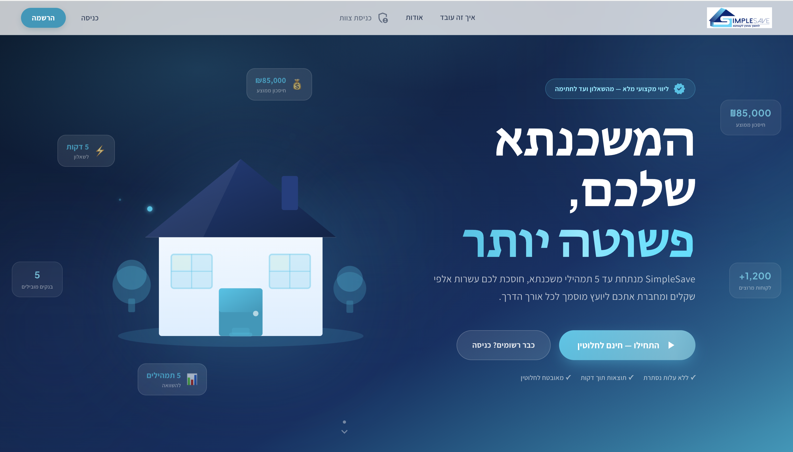
  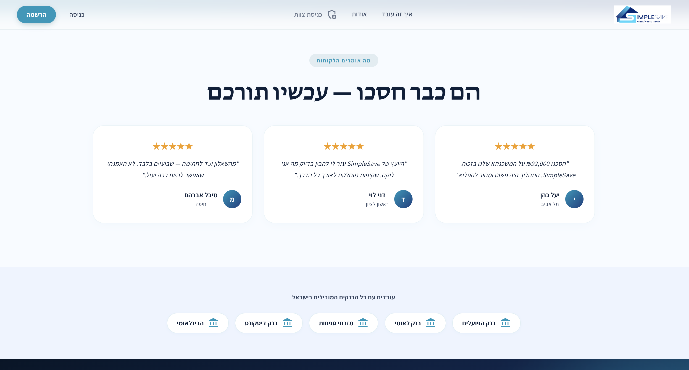
</p>
<p align="center">
  <sub>Homepage — hero</sub> • <sub>Homepage — testimonials & banks</sub>
</p>

<p align="center">
  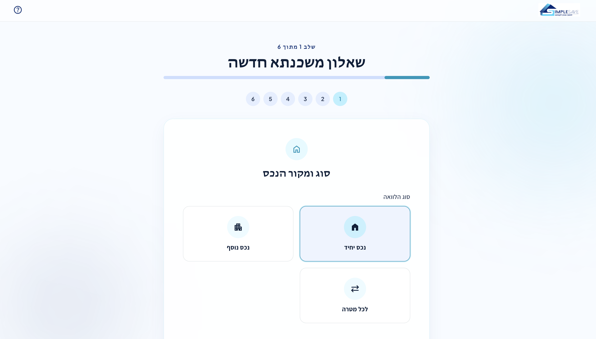
  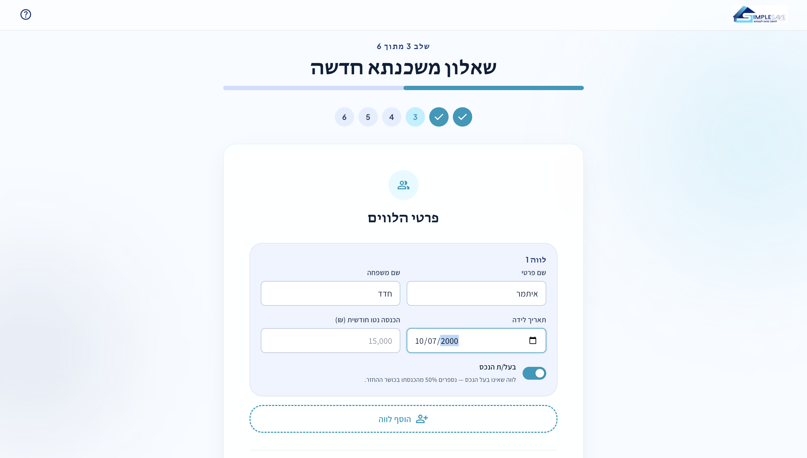
  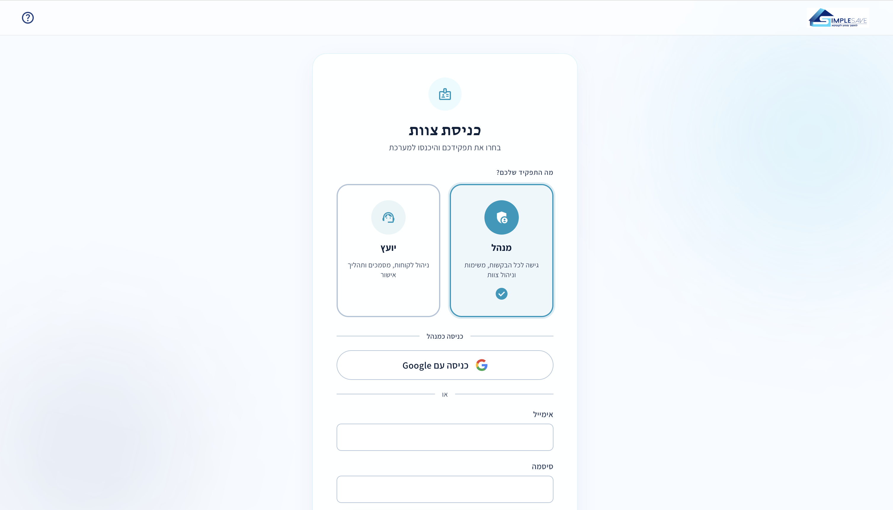
</p>
<p align="center">
  <sub>Questionnaire — loan type & source</sub> • <sub>Questionnaire — borrowers</sub> • <sub>Staff sign-in</sub>
</p>

## 🕐 Mix Comparison

<p align="center">
  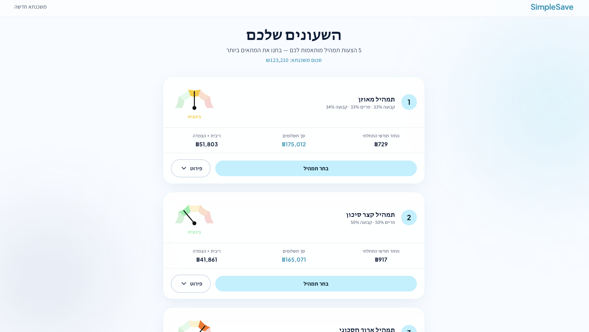
</p>
<p align="center">
  <sub>5-Way Comparison ("Clocks")</sub>
</p>

## 🔐 Personal Area

<p align="center">
  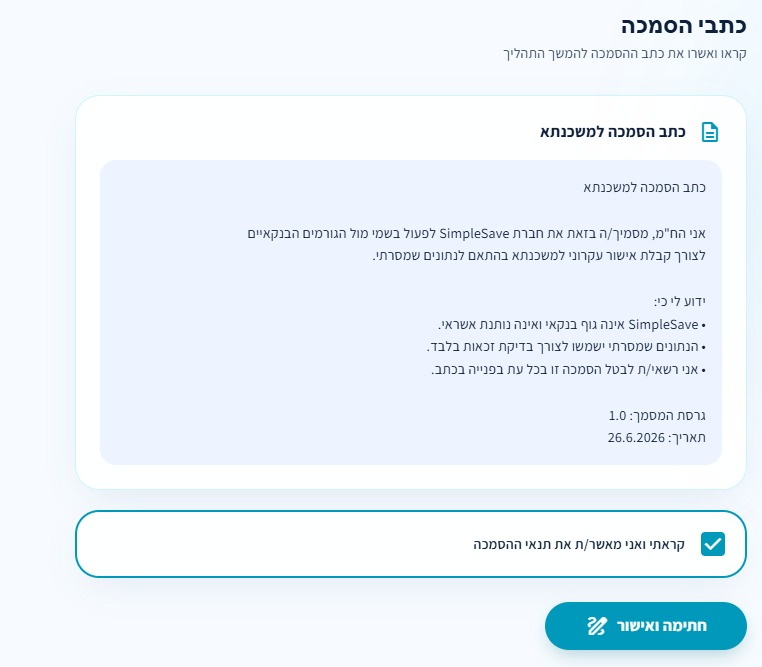
</p>
<p align="center">
  <sub>Progressive lock — disclosure acknowledgment</sub>
</p>

## 🧑‍💼 Advisor & Admin

<p align="center">
  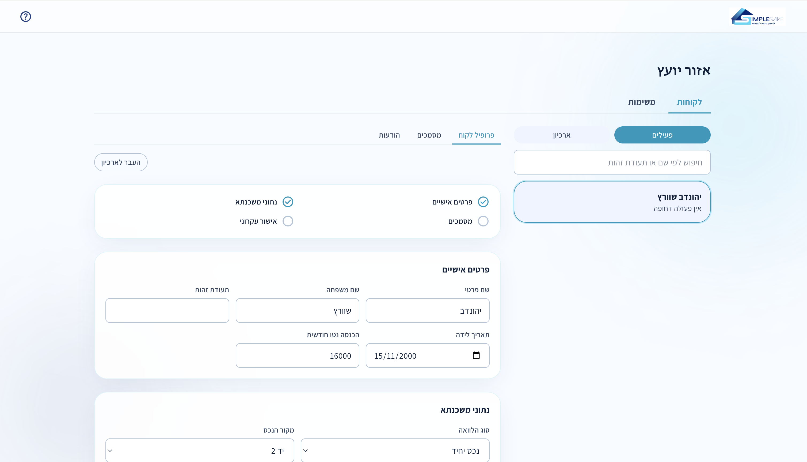
  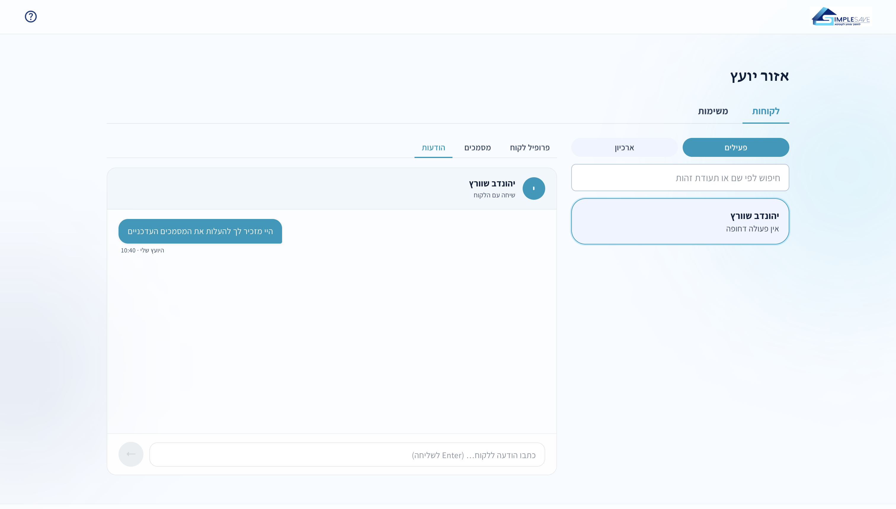
</p>
<p align="center">
  <sub>Advisor — client checklist</sub> • <sub>Advisor — messages</sub>
</p>

<p align="center">
  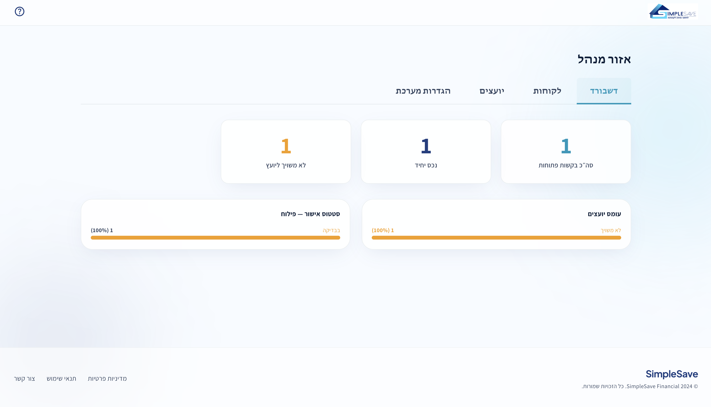
  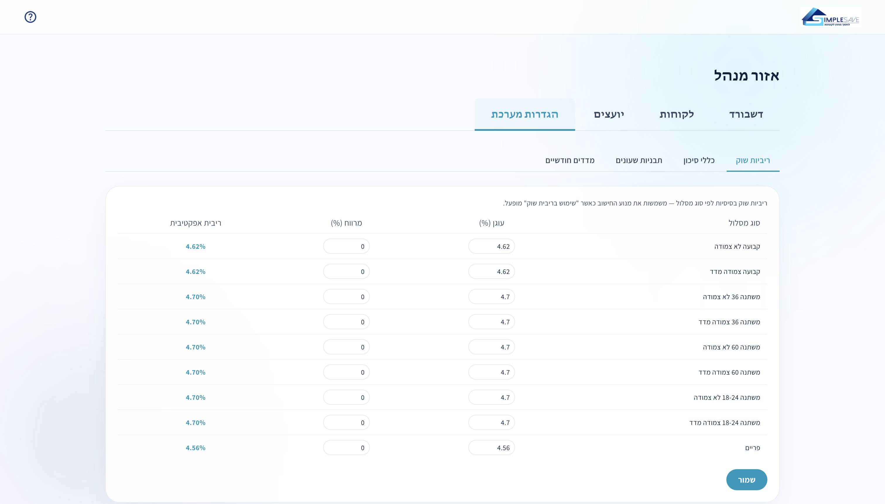
</p>
<p align="center">
  <sub>Admin — dashboard</sub> • <sub>Admin — rate editor</sub>
</p>

## 🤖 AI Agents

<p align="center">
  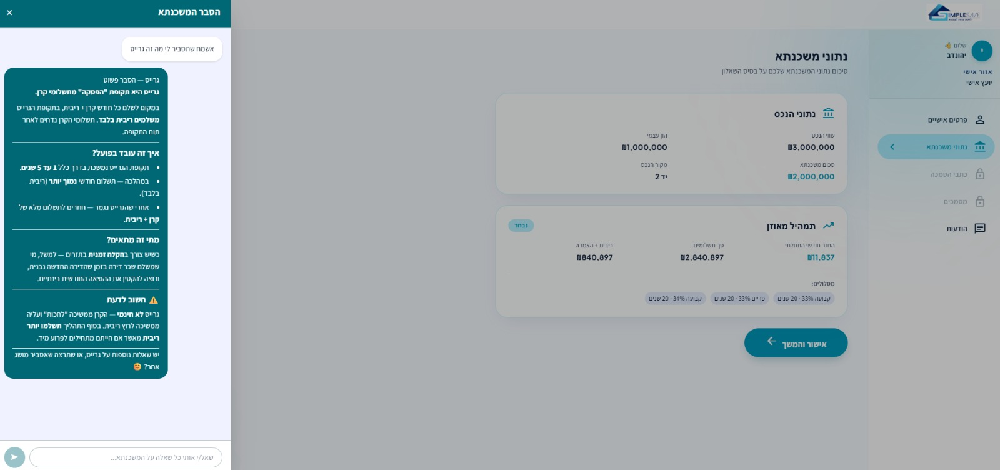
</p>
<p align="center">
  <sub>Explainer agent — grounded in the glossary + the user's real data</sub>
</p>

---

# 🚧 Future Enhancements

- Real e-signature integration (today: lightweight checkbox acknowledgment)
- Actual payment processing behind the "buy the mix" flow (today: UI stub only — [ADR-0003](docs/adr/0003-payment-button-is-a-visual-stub.md))
- Refinance and mortgage-insurance questionnaires (separate planned tracks, out of scope for this round)
- Accessibility/disability-standard compliance pass ([ADR-0005](docs/adr/0005-disability-accessibility-deferred.md))
- Additional UI languages beyond Hebrew (i18n scaffolding already in place)
- Bank balance-certificate PDF import for refinance flows (ported from the original simulator's per-bank parsers, currently descoped)

---

# 🏃 Run Locally

```
cd app
npm install
cp .env.example .env.local   # fill in Firebase web config from the console
npm run dev
```

# 📚 Project Documentation

- [`ARCHITECTURE.md`](ARCHITECTURE.md) — full system architecture
- [`CONTEXT.md`](CONTEXT.md) — shared product/domain glossary
- [`docs/adr/`](docs/adr) — architecture decision records
- [`CONTRIBUTING.md`](CONTRIBUTING.md) — team git workflow

---

## 👥 Team

Built in 24 hours for a hackathon by a team of three:

**Itamar Hadad**
📧 Email: hzitamar4@gmail.com
🔗 LinkedIn: [linkedin.com/in/itamar-hadad](https://www.linkedin.com/in/itamar-hadad-1aa946307/)

**liadnave25** · **RubiDan**

Repo: [github.com/Itamar-Hadad/mortgage-web](https://github.com/Itamar-Hadad/mortgage-web)
